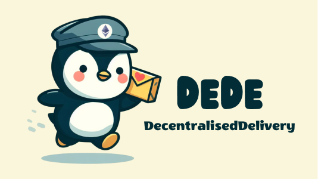

Your Decentralized Delivery Network

🖌️ UI/UX Design: 
<https://www.figma.com/file/8v6q8eWYWX0326q0eJ7qx7/Designs?type=design&node-id=0%3A1&mode=design&t=rrCacmx2eVPdh2bP-1>

💡 Live Site: <https://dede-seven.vercel.app/>

## Motivation

DeDe (Decentralized Delivery Network) is designed to improve the traditional delivery service landscape. It addresses critical issues like high delivery costs, tracking inaccuracies, limited service reach, and unfair courier compensation. By leveraging blockchain technology, DeDe ensures direct transactions between customers and couriers, leading to fairer compensation and reduced overall costs. The platform employs Proof of Interaction using ARX’s proprietary technolofy for real-time, accurate tracking, enhancing customer trust and courier accountability. Additionally, DeDe introduces a unique scoring system, the DeDe Score, based on courier performance and sender reliability, fostering trust within the network. The platform also features an anonymous messaging system for secure communication among participants. DeDe is not just a delivery service; it's a comprehensive ecosystem designed to make deliveries more efficient, transparent, and fair for all stakeholders. 

## Deployments

see [deployments](./packages/contracts/deployments/)

## Integration

### ARX

- Unique NFC identifiers used to prove physical presence of couriers at delivery locations.

### Push

- Notify users when a delivery request is made
- Notify sender when a delivery is picked up
- Notify sender when a delivery has reached the destination
- Notify courier when a delivery payment is released after confirmation by the recepient

### Waku

- Communication between couriers and senders.
- Notification when a package has moved.

### Metamask Snap

- Integration with PUSH where a Notification is issued when a parcel arrived at a destination.

### Wallet Connect

- Integrated with Web3Inbox to send delivery notifications to senders.